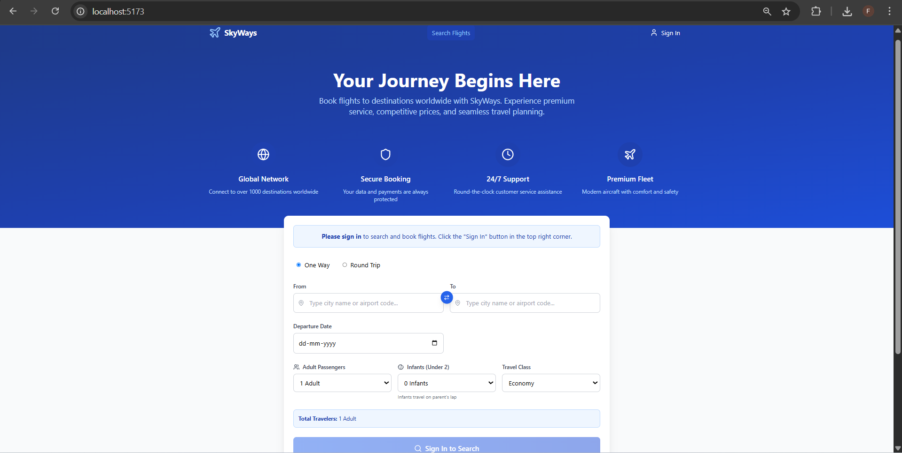
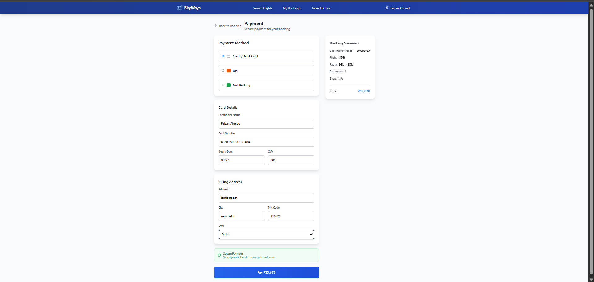

# Airline-Reservation-System
A modern and responsive Airline Reservation System that allows users to search, book, and manage flight reservations. Built as a Minimum Viable Product (MVP), it also includes optional integrations for hotel and cab booking as additional features for a complete travel experience.
A modern, responsive airline reservation system built with **React**, **Vite**, and **Tailwind CSS**.

🧩 Core Features (Airline Booking)
🔍 Flight Search
Search flights by:

Source & Destination

Departure & Return Dates

Class (Economy, Business, First)

Price Range

💺 Seat Availability
Real-time seat availability per class

Interactive seat selection UI

🧍 Passenger Booking Flow
Enter passenger details with validation

Smart fare calculation

Booking summary with confirmation

🔒 User Authentication
Secure sign-up/login

View and manage booking history

📄 Booking Management
Unique booking ID for every reservation

View, cancel, or modify flights

Admin-side options for managing flight schedules

💳 Payment Flow (UI Only)
Frontend-only payment flow (no backend integration)

Payment page serves as placeholder for future gateway integration

🏨 Hotel & 🚗 Cab Booking (Add-on Modules)
These are optional features that enhance the flight booking experience.

🏨 Hotel Booking Highlights
Hotel suggestions based on flight destination

Room categories: Standard, Deluxe, Suite, Luxury

Amenities, images, ratings, and guest capacity

Smart sorting: distance from airport, ratings, price

🚗 Cab Booking Highlights
Cab types: Economy, Premium, Luxury, SUV

Services: Airport pickup/drop, city rides

Fare calculation based on distance
🔧 Tech Stack
Layer	Tech
Frontend	React.js + Tailwind CSS
Backend	Node.js + Express
Database	MySQL
Authentication	JWT
Design	Figma-style card layout, responsive breakpoints
Payment	UI flow only 

## 🖼️ UI Screenshots

### 🏠 Homepage


### 👤 Create Account


### 🔍 Flight Search Results


### 💺 Seat Selection


### 🧍 Passenger Details


### 💳 Payment Page (UI Only)


### ✅ Booking Confirmation


🚀 Getting Started
1️⃣ Clone the Repository
bash
Copy
Edit
git clone https://github.com/Faizan0602/Airline-Reservation-System.git
cd Airline-Reservation-System
2️⃣ Install Frontend Dependencies
bash
Copy
Edit
cd client
npm install
npm run dev
3️⃣ Setup Backend
bash
Copy
Edit
cd ../server
npm install
npm run dev
4️⃣ Setup MySQL Database
Create a database named airline_db

Run the provided schema.sql in database/

Configure .env with:

env
Copy
Edit
DB_HOST=localhost
DB_USER=root
DB_PASSWORD=yourpassword
DB_NAME=airline_db
JWT_SECRET=your_jwt_secret

🎯 Key Advantages
Clean, intuitive booking experience

Modular add-ons for future scalability

Easily extendable backend

Built for real-world usability and customization

📄 License
Licensed under the MIT License.


```bash
git clone https://github.com/your-username/skyways-airline-reservation.git
cd skyways-airline-reservation
npm install
npm run dev
